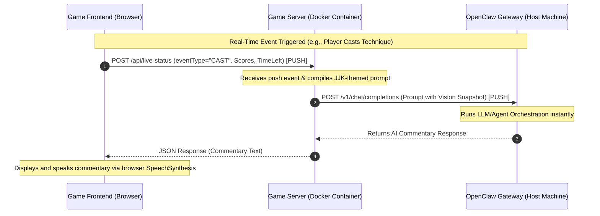

# 🎙️ JJK AI Commentator & OpenClaw Integration | 咒術 AI 旁白與 OpenClaw 整合

This document explains the system design and architecture of the direct, push-based **OpenClaw AI Commentator** integration in the **Domain Expansion AR Game**.

本文檔說明了「領域展開 AR 遊戲」中直接、基於推送（Push-based）的 **OpenClaw AI 旁白** 整合系統設計與架構。

---

## 📐 System Design | 系統設計

Our JJK AI Commentator uses a fully **event-driven, push-based pipeline** to achieve real-time response times with zero polling overhead. 

我們的咒術 AI 旁白採用完全**事件驅動、基於推送**的流水線，以實現零輪詢（polling）開銷的即時響應。

### Real-Time Flow Diagram | 即時流程圖



---

## 🔄 Commentary Conversation Flow | 旁白對話流程

To achieve the best user experience with zero repetitive confirmation chatter and minimal API token costs, the system implements a streamlined, stateful conversation flow across the battle lifecycle:

為了解決大模型常見的「重複確認人設」與「明白/收到」之類的囉唆話，並將 API Token 成本與延遲降到最低，本系統在對戰生命週期中實作了一體化的狀態化對話流：

### 1. Match Start / Initialization | 對戰開始與初始化
- **Trigger (RESET event)**: Fired when the viewer starts a new match.
- **Backend Flow**:
  1. Sends a standalone `/reset` message turn to OpenClaw to clear any previous conversation history.
  2. Immediately following the reset success, the backend compiles the full system prompt (commentator persona, Cantonese and formatting constraints) along with the opening welcome directive.
  3. **Attaches both Player 1 (P1) and Player 2 (P2) webcam snapshots** to the content payload.
- **AI Response**: The AI commentator immediately acts as a hype caster, greeting the audience and humorously roasting the facial expressions, attire, or rooms of both P1 and P2 based on the images (with **zero** "Received/Understood" confirmation chatter).
- **觸發（RESET 事件）**：當觀眾端啟動新對戰時觸發。
- **後端流程**：
  1. 向 OpenClaw 發送獨立的 `/reset` 訊息以清除先前的對答歷史。
  2. 重設成功後，後端隨即將完整的系統提示詞（解說員人設、香港廣東話與格式限制）與開局歡迎指令整合。
  3. **同時夾帶 Player 1 (P1) 與 Player 2 (P2) 的 Webcam 開局快照**。
- **AI 響應**：AI 旁白立即進入角色發表熱血澎湃的開場致詞，並根據照片生動吐槽 P1 與 P2 的神情、服裝或背景（**絕對不說**任何「收到/明白人設」等確認廢話）。

### 2. Live Gameplay Action | 戰鬥進行中
- **Trigger (CAST event)**: Fired every time a player successfully triggers a gesture technique.
- **Backend Flow**:
  - Compiles a lightweight, pure-text prompt representing the active event and current standing (e.g., `P1 finished 1 time, P2 finished 0 times. P2 casted "Hollow Purple"`).
  - **No images are attached** during this phase to maximize performance, save network bandwidth, and reduce input token charges.
- **AI Response**: Delivers an ultra-short, high-energy 1-2 sentence real-time commentary reaction.
- **觸發（CAST 事件）**：每當玩家成功施展手勢術式時觸發。
- **後端流程**：
  - 組裝輕量級的純文字 Prompt，僅傳遞當前術式事件與雙方分數（例如：`P1 完成了 1 次，P2 完成了 0 次。P2 施放了「茈」`）。
  - **此階段不夾帶任何圖片**，以最大化語音生成速度、節省網路頻寬並極大地降低 API 費用。
- **AI 響應**：輸出極其簡短、高能量的 1-2 句實時熱血解說。

### 3. Match Conclusion | 對局結束結算
- **Trigger (battle-result event)**: Fired upon match completion.
- **Backend Flow**:
  - Formats the grand finale prompt stating the winner and final score.
  - **Re-attaches both Player 1 (P1) and Player 2 (P2) ending webcam snapshots** to the payload.
- **AI Response**: Delivers a spectacular and dramatic Cantonese final remark, celebrating the winner (or draw) while commenting on the final physical expressions of the contestants.
- **觸發（battle-result 事件）**：對戰分出勝負或時間到結束時觸發。
- **後端流程**：
  - 格式化宣佈獲勝者與最終比分的結算 Prompt。
  - **重新夾帶雙方玩家在終局時的最新 Webcam 快照**。
- **AI 響應**：發表極具動漫配音震撼感的香港廣東話結算致詞，為贏家喝采，並對雙方玩家終局時精疲力竭或生龍活虎的 Webcam 神態進行趣味性總結。

---

## 🌟 Key Technical Features | 關鍵技術特點

### 1. Direct Gateway Connection | 直接網關連接
- **No API Bridge Required**: The game server (`server.js`) bypasses legacy intermediate APIs and connects directly to the OpenClaw Gateway using OpenAI-compatible REST endpoints (`/v1/chat/completions`).
- **無須 API 橋接器**: 遊戲伺服器 (`server.js`) 繞過傳統的中間 API，直接使用相容於 OpenAI 的 REST 端點 (`/v1/chat/completions`) 連接至 OpenClaw 網關。
- **Auto-Config & Mounting**: The signaling docker container mounts the host’s `~/.openclaw` directory to dynamically load the gateway's port and authentication token without manual configuration.
- **自動配置與掛載**: 信令 Docker 容器掛載主機的 `~/.openclaw` 目錄，以動態載入網關的埠號與認證金鑰，無須手動配置。

### 2. High-Performance Multimodal Vision | 高效能多模態視覺
- **MediaPipe Friendly**: Snapshotting is decoupled from the main rendering loop. A low-resolution canvas (`320x240` at `0.6` JPEG quality) is used to compress images to around ~15KB.
- **MediaPipe 友善**: 快照擷取與主渲染循環解耦。使用低解析度畫布（`320x240` 及 `0.6` JPEG 品質）將影像壓縮至約 ~15KB。
- **On-Demand (Single-Shot) Snapshot Upload**: Instead of uploading images continuously every 2 seconds, snapshots are triggered on-demand at key game checkpoints (battle start and battle end) via the `CAPTURE_WEBCAM_FRAME` broadcast event. This significantly reduces CPU, webcam, and battery usage on players' devices.
- **按需（單次）快照上傳**: 取代每 2 秒無間斷地上傳影像，系統在關鍵遊戲節點（對戰開始與結束）時，透過 `CAPTURE_WEBCAM_FRAME` 廣播事件按需觸發單次快照。這極大地降低了玩家設備的 CPU、相機與電池消耗。
- **Multi-Player Webcam Support**: Stopted image overwriting by saving separate slots for P1 and P2 based on player role (`latestWebcamFrameP1` and `latestWebcamFrameP2`). Both images are attached to the model simultaneously, enabling the commentator to roast both players synchronously while keeping intermediate game updates pure text for optimal cost-saving.
- **多玩家鏡頭支援**: 系統透過依玩家角色分開儲存的插槽（`latestWebcamFrameP1` 與 `latestWebcamFrameP2`）防止圖片覆蓋。這兩張圖片將被同時傳送給模型，讓解說員能在開局與結算時同時吐槽雙方玩家，同時將中期的戰況更新保持在純文字狀態，達到最省錢與快速的高效能平衡。

### 3. Real-Time Status & Results Tracking | 即時狀態與結果追蹤
- **Cast Events (`/api/live-status`)**: Whenever a player successfully triggers a technique, an instant payload is pushed. The agent receives the technique's details and immediately delivers high-energy JJK-style live commentary.
- **施放事件 (`/api/live-status`)**: 每當玩家成功觸發術式時，會立即推送負載。代理會收到術式的詳細資訊並立即提供高能量的咒術風即時旁白。
- **Battle Results (`/api/battle-result`)**: Fired at match completion to let the agent deliver grand concluding victory remarks tailored to the winner.
- **對戰結果 (`/api/battle-result`)**: 在對戰結束時觸發，讓代理為勝者量身打造宏大的勝利結算致詞。

### 4. Interactive Auto-Battle Starter | 互動式自動對戰啟動
- **Start Battle Command**: The agent can output a special trigger tag (e.g., `[start_battle]`) during discussion. The game server parses this tag and automatically broadcasts the `START_BATTLE` signal to all connected sockets in that room.
- **啟動對戰命令**: 代理可以在對答中輸出特殊的觸發標籤（例如：`[start_battle]`）。遊戲伺服器會解析此標籤，並自動向該房間的所有連接通訊端廣播 `START_BATTLE` 信令。

---

## 🛠️ Configuration & Deployment | 配置與部署

### Volume Mount Configuration | 磁碟卷掛載配置

In `docker-compose.yml`, the `~/.openclaw` folder is mounted as read-only, allowing the container to dynamically read credentials and configurations:

在 `docker-compose.yml` 中，將 `~/.openclaw` 資料夾掛載為唯讀，使容器可以動態讀取主機配置：

```yaml
services:
  game-server:
    ports:
      - "3443:3443"
    environment:
      - PORT=3443
      - OPENCLAW_HOST=host.docker.internal
      - OPENCLAW_AGENT_ID=${OPENCLAW_AGENT_ID:-main}
    extra_hosts:
      - "host.docker.internal:host-gateway"
    volumes:
      - .:/app
      - /app/node_modules
      - ~/.openclaw:/root/.openclaw:ro
```

---

## 🎭 Dynamic Routing & Stateful Session Handling | 動態代理路由與狀態化會話處理

Our direct connection uses advanced headers and parameters matching OpenClaw’s internal context resolution scheme to achieve dynamic agent mapping and conversation memory preservation.

我們的直接連接使用符合 OpenClaw 內部上下文解析架構的高級標頭與參數，以實現動態代理對戰路由與對答記憶保留。

### 1. Dynamic Agent Selection | 動態代理選擇
- **Configuration**: The target agent ID is resolved from the `OPENCLAW_AGENT_ID` environment variable first. If empty, the server dynamically reads it from the host's loaded `~/.openclaw/openclaw.json` file (looking for keys such as `gateway.agentId`, `gateway.agent_id`, `agents.defaults.agentId`, or `agents.defaults.agent_id`). If not found in either, it fallback-defaults to `"main"`.
- **配置**: 目標代理 ID 首選自 `OPENCLAW_AGENT_ID` 環境變數。若無該環境變數，則從掛載的主機端 `~/.openclaw/openclaw.json` 文件中動態讀取（支持鍵名如 `gateway.agentId`、`gateway.agent_id` 或 `agents.defaults.agentId`），若皆無設定則安全降級默認為 `"main"`。
- **Resolution**: The server maps this to the model query string parameter as `"openclaw/<agentId>"` (e.g., `openclaw/main`). This aligns with OpenClaw's strict model-visibility policies.
- **解析**: 伺服器將其映射到模型查詢字串參數為 `"openclaw/<agentId>"`（例如：`openclaw/main`）。這符合 OpenClaw 嚴格的模型可見性政策。

### 2. Conversation Memory & Stateful Sessions | 對話記憶與狀態化會話
By default, standard stateless HTTP requests generate a new session UUID, causing the commentator to lose all previous context. To preserve conversation history across turns, we pass **both** explicit session headers and user mappings:

預設情況下，標準無狀態 HTTP 請求會產生新的會話 UUID，導致旁白遺失所有先前的上下文。為了在多輪對答中保留對話歷史記錄，我們傳遞了**明確的會話標頭與使用者映射**：

- **Standard Header**:
  `x-openclaw-session-key: agent:<agentId>:openai-user:<sessionId>`
  This tells OpenClaw to bypass dynamic UUID generation and load the persistent session database.
  
  這告訴 OpenClaw 繞過動態 UUID 產生，並載入持久會話資料庫。
  
- **User Param**:
  `user: sessionId`
  Specifies the unique game session ID inside the OpenAI body payload for first-class OpenAI schema compliance.
  
  在 OpenAI 本文負載中指定唯一的遊戲會話 ID，以符合一等（first-class）的 OpenAI 結構定義。

---

## 🟢 Direct Host Deployment (Native Startup) | 直接主機部署（本機啟動）

When running natively (directly on the host via `node server.js` without Docker), the integration becomes even more seamless:

當本機運行時（無須 Docker，直接在主機上透過 `node server.js` 啟動），整合流程將更為流暢：

1. **Zero-Configuration Home Directory Resolution**:
   The server natively parses `require('os').homedir()` to directly find and open `~/.openclaw/openclaw.json` on your host. There is no need for manual environment variables or file mounts.
   
   伺服器會原生解析 `require('os').homedir()`，以直接在您主機的主目錄中尋找並開啟 `~/.openclaw/openclaw.json`。無須手動設定環境變數或掛載檔案。

2. **Unified Port & Token Resolution**:
   Port and token verification occur instantly during startup, allowing the host-side game server to talk to the local host-side OpenClaw Gateway at lightning speed:
   ```bash
   node server.js
   ```
   
   啟動時即時完成埠號與語彙基元驗證，使主機端遊戲伺服器可以電閃般的速度與本機主機端 OpenClaw 網關進行通訊：
   ```bash
   node server.js
   ```

