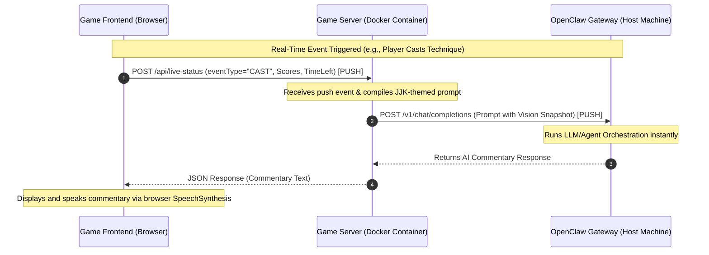

# 🎙️ JJK AI Commentator & OpenClaw Integration | 咒術 AI 旁白與 OpenClaw 整合

This document explains the system design and architecture of the direct, push-based **OpenClaw AI Commentator** integration in the **Domain Expansion AR Game**.

本文檔說明了「領域展開 AR 遊戲」中直接、基於推送（Push-based）的 **OpenClaw AI 旁白** 整合系統設計與架構。

---

## 📐 System Design | 系統設計

Our JJK AI Commentator uses a fully **event-driven, push-based pipeline** to achieve real-time response times with zero polling overhead. 

我們的咒術 AI 旁白採用完全**事件驅動、基於推送**的流水線，以實現零輪詢（polling）開銷的即時響應。

### Real-Time Flow Diagram | 即時流程圖



---

## 🌟 Key Technical Features | 關鍵技術特點

### 1. Direct Gateway Connection | 直接網關連接
- **No API Bridge Required**: The game server (`server.js`) bypasses legacy intermediate APIs and connects directly to the OpenClaw Gateway using OpenAI-compatible REST endpoints (`/v1/chat/completions`).
- **無須 API 橋接器**: 遊戲伺服器 (`server.js`) 繞過傳統的中間 API，直接使用相容於 OpenAI 的 REST 端點 (`/v1/chat/completions`) 連接至 OpenClaw 網關。
- **Auto-Config & Mounting**: The signaling docker container mounts the host’s `~/.openclaw` directory to dynamically load the gateway's port and authentication token without manual configuration.
- **自動配置與掛載**: 信令 Docker 容器掛載主機的 `~/.openclaw` 目錄，以動態載入網關的埠號與認證金鑰，無須手動配置。

### 2. High-Performance Multimodal Vision | 高效能多模態視覺
- **MediaPipe Friendly**: Snapshotting is decoupled from the main rendering loop. A low-resolution canvas (`320x240` at `0.6` JPEG quality) is used to compress images to around ~15KB.
- **MediaPipe 友善**: 快照擷取與主渲染循環解耦。使用低解析度畫布（`320x240` 及 `0.6` JPEG 品質）將影像壓縮至約 ~15KB。
- **Periodic Snapshot Upload**: Uploads snapshots to the game server every **2 seconds** asynchronously. The server maintains a single-frame cache for active sessions and attaches it as an inline image to the next AI comment request, giving the JJK agent "vision" at any time.
- **定期快照上傳**: 每 **2 秒**非同步將快照上傳至遊戲伺服器。伺服器為活動會話保留單影格快照快取，並將其作為內聯圖像附加至下一次 AI 旁白請求，使咒術代理隨時擁有「視覺」。

### 3. Real-Time Status & Results Tracking | 即時狀態與結果追蹤
- **Cast Events (`/api/live-status`)**: Whenever a player successfully triggers a technique, an instant payload is pushed. The agent receives the technique's details and immediately delivers high-energy JJK-style live commentary.
- **施放事件 (`/api/live-status`)**: 每當玩家成功觸發術式時，會立即推送負載。代理會收到術式的詳細資訊並立即提供高能量的咒術風即時旁白。
- **Battle Results (`/api/battle-result`)**: Fired at match completion to let the agent deliver grand concluding victory remarks tailored to the winner.
- **對戰結果 (`/api/battle-result`)**: 在對戰結束時觸發，讓代理為勝者量身打造宏大的勝利結算致詞。

### 4. Interactive Auto-Battle Starter | 互動式自動對戰啟動
- **Start Battle Command**: The agent can output a special trigger tag (e.g., `[start_battle]`) during discussion. The game server parses this tag and automatically broadcasts the `START_BATTLE` signal to all connected sockets in that room.
- **啟動對戰命令**: 代理可以在對答中輸出特殊的觸發標籤（例如：`[start_battle]`）。遊戲伺服器會解析此標籤，並自動向該房間的所有連接通訊端廣播 `START_BATTLE` 信令。

---

## 🛠️ Configuration & Deployment | 配置與部署

### Volume Mount Configuration | 磁碟卷掛載配置

In `docker-compose.yml`, the `~/.openclaw` folder is mounted as read-only, allowing the container to dynamically read credentials and configurations:

在 `docker-compose.yml` 中，將 `~/.openclaw` 資料夾掛載為唯讀，使容器可以動態讀取主機配置：

```yaml
services:
  game-server:
    ports:
      - "3443:3443"
    environment:
      - PORT=3443
      - OPENCLAW_HOST=host.docker.internal
      - OPENCLAW_AGENT_ID=${OPENCLAW_AGENT_ID:-main}
    extra_hosts:
      - "host.docker.internal:host-gateway"
    volumes:
      - .:/app
      - /app/node_modules
      - ~/.openclaw:/root/.openclaw:ro
```

---

## 🎭 Dynamic Routing & Stateful Session Handling | 動態代理路由與狀態化會話處理

Our direct connection uses advanced headers and parameters matching OpenClaw’s internal context resolution scheme to achieve dynamic agent mapping and conversation memory preservation.

我們的直接連接使用符合 OpenClaw 內部上下文解析架構的高級標頭與參數，以實現動態代理對戰路由與對答記憶保留。

### 1. Dynamic Agent Selection | 動態代理選擇
- **Configuration**: The target agent ID is read from the `OPENCLAW_AGENT_ID` environment variable (default: `main`).
- **配置**: 目標代理 ID 從 `OPENCLAW_AGENT_ID` 環境變數（預設值為 `main`）讀取。
- **Resolution**: The server maps this to the model query string parameter as `"openclaw/<agentId>"` (e.g., `openclaw/main`). This aligns with OpenClaw's strict model-visibility policies.
- **解析**: 伺服器將其映射到模型查詢字串參數為 `"openclaw/<agentId>"`（例如：`openclaw/main`）。這符合 OpenClaw 嚴格的模型可見性政策。

### 2. Conversation Memory & Stateful Sessions | 對話記憶與狀態化會話
By default, standard stateless HTTP requests generate a new session UUID, causing the commentator to lose all previous context. To preserve conversation history across turns, we pass **both** explicit session headers and user mappings:

預設情況下，標準無狀態 HTTP 請求會產生新的會話 UUID，導致旁白遺失所有先前的上下文。為了在多輪對答中保留對話歷史記錄，我們傳遞了**明確的會話標頭與使用者映射**：

- **Standard Header**:
  `x-openclaw-session-key: agent:<agentId>:openai-user:<sessionId>`
  This tells OpenClaw to bypass dynamic UUID generation and load the persistent session database.
  
  這告訴 OpenClaw 繞過動態 UUID 產生，並載入持久會話資料庫。
  
- **User Param**:
  `user: sessionId`
  Specifies the unique game session ID inside the OpenAI body payload for first-class OpenAI schema compliance.
  
  在 OpenAI 本文負載中指定唯一的遊戲會話 ID，以符合一等（first-class）的 OpenAI 結構定義。

---

## 🟢 Direct Host Deployment (Native Startup) | 直接主機部署（本機啟動）

When running natively (directly on the host via `node server.js` without Docker), the integration becomes even more seamless:

當本機運行時（無須 Docker，直接在主機上透過 `node server.js` 啟動），整合流程將更為流暢：

1. **Zero-Configuration Home Directory Resolution**:
   The server natively parses `require('os').homedir()` to directly find and open `~/.openclaw/openclaw.json` on your host. There is no need for manual environment variables or file mounts.
   
   伺服器會原生解析 `require('os').homedir()`，以直接在您主機的主目錄中尋找並開啟 `~/.openclaw/openclaw.json`。無須手動設定環境變數或掛載檔案。

2. **Unified Port & Token Resolution**:
   Port and token verification occur instantly during startup, allowing the host-side game server to talk to the local host-side OpenClaw Gateway at lightning speed:
   ```bash
   node server.js
   ```
   
   啟動時即時完成埠號與語彙基元驗證，使主機端遊戲伺服器可以電閃般的速度與本機主機端 OpenClaw 網關進行通訊：
   ```bash
   node server.js
   ```

